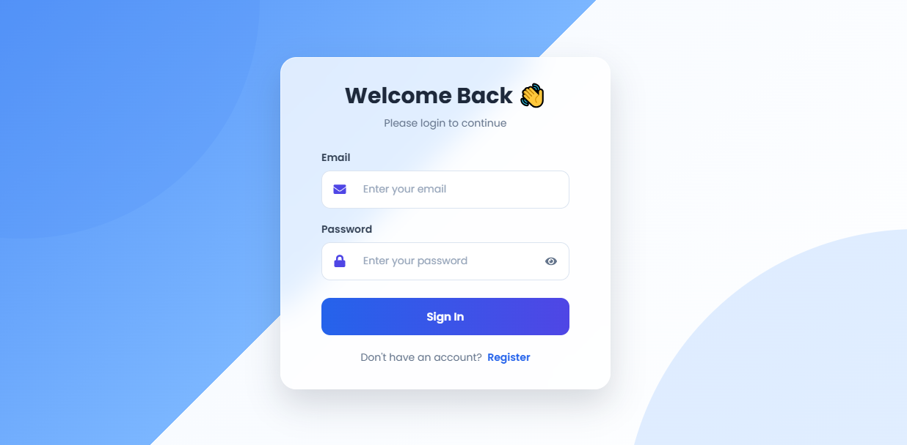
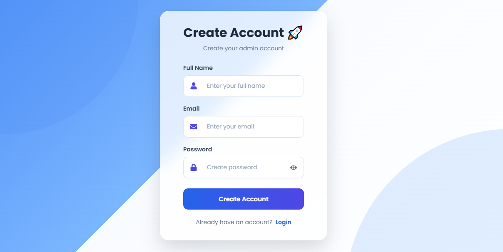
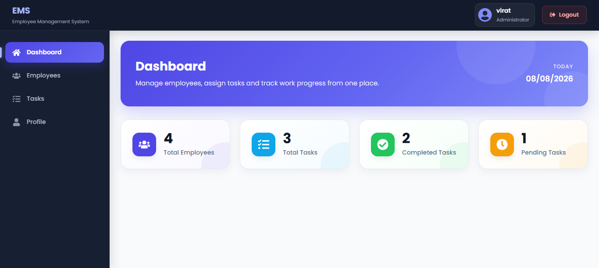
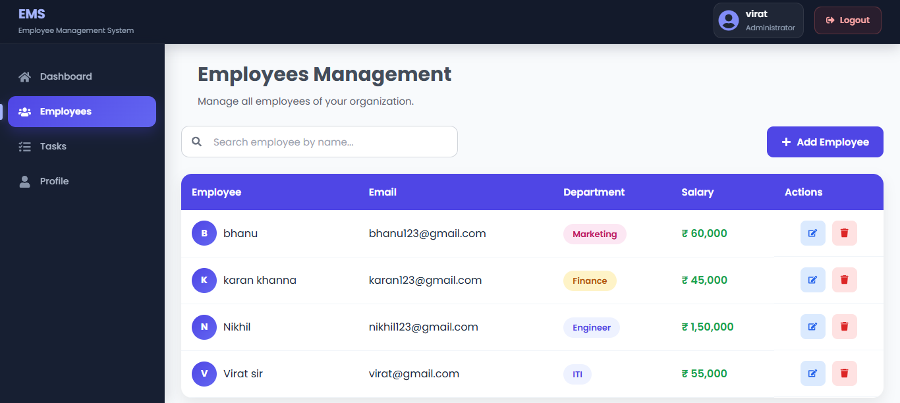
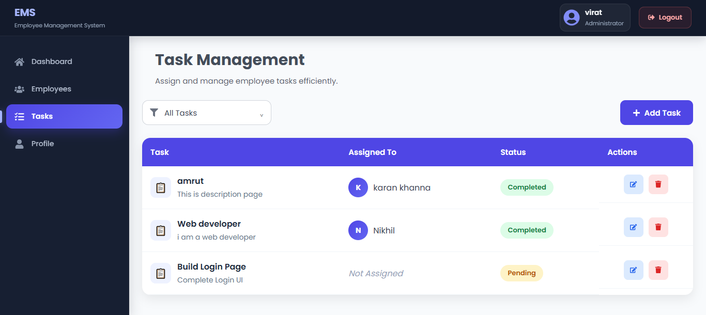
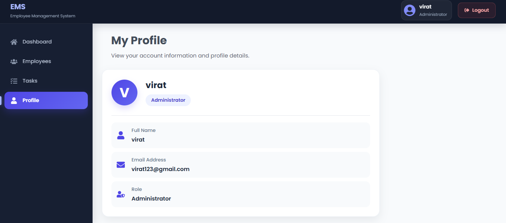

# MERN Employee Management System

A full-stack **Employee Management System** built with the **MERN Stack** — MongoDB, Express.js, React.js, and Node.js.

The application provides a modern dashboard for managing employees and tasks, along with JWT-based authentication, protected routes, profile information, REST API integration, loading states, empty states, and responsive UI.

---

## 📌 Features

### 🔐 Authentication
- User registration and login
- JWT-based authentication
- Password hashing with bcryptjs
- Protected frontend and backend routes
- Logout functionality

### 📊 Dashboard
- Total employees
- Total tasks
- Completed tasks
- Pending tasks
- Welcome section
- Current date
- Quick application overview

### 👨‍💼 Employee Management
- Add, view, edit and delete employees
- Search employees
- Department information
- Salary information
- Employee avatars / initials
- Responsive employee table

### 📋 Task Management
- Create, view, edit and delete tasks
- Assign tasks to employees
- Filter tasks by status
- Track task status
- Responsive task table

### 👤 Profile
- View authenticated user's information
- Name, email and role

### 🎨 UI & UX
- Premium dark navbar
- Responsive sidebar
- Dashboard cards
- Responsive forms and tables
- Loading spinner
- Empty states
- Hover effects
- Toast notifications
- SweetAlert confirmation dialogs
- Custom 404 page
- Mobile-friendly layout

---

## 🛠️ Tech Stack

### Frontend
- React.js
- Vite
- JavaScript (ES6+)
- React Router DOM
- Axios
- React Icons
- React Toastify
- SweetAlert2
- CSS3

### Backend
- Node.js
- Express.js
- MongoDB
- Mongoose
- JSON Web Token (JWT)
- bcryptjs
- CORS
- dotenv

### Development Tools
- VS Code
- MongoDB Compass
- Git
- GitHub
- npm

---

## 📂 Project Structure

```text
MERN-Employee-Management/
│
├── frontend/
│   ├── public/
│   ├── src/
│   │   ├── components/
│   │   │   ├── Layout.jsx
│   │   │   ├── Navbar.jsx
│   │   │   ├── Sidebar.jsx
│   │   │   ├── ProtectedRoute.jsx
│   │   │   └── ...
│   │   ├── pages/
│   │   │   ├── Login.jsx
│   │   │   ├── Register.jsx
│   │   │   ├── Dashboard.jsx
│   │   │   ├── Employees.jsx
│   │   │   ├── Tasks.jsx
│   │   │   ├── Profile.jsx
│   │   │   └── NotFound.jsx
│   │   ├── services/
│   │   │   └── api.js
│   │   ├── styles/
│   │   │   └── ...
│   │   ├── App.jsx
│   │   └── main.jsx
│   ├── package.json
│   └── vite.config.js
│
├── backend/
│   ├── config/
│   │   └── db.js
│   ├── controllers/
│   │   ├── authController.js
│   │   ├── employeeController.js
│   │   ├── taskController.js
│   │   └── dashboardController.js
│   ├── middleware/
│   │   └── authMiddleware.js
│   ├── models/
│   │   ├── User.js
│   │   ├── Employee.js
│   │   └── Task.js
│   ├── routes/
│   │   ├── authRoutes.js
│   │   ├── employeeRoutes.js
│   │   ├── taskRoutes.js
│   │   └── dashboardRoutes.js
│   ├── .env
│   ├── server.js
│   └── package.json
│
├── .gitignore
├── README.md
└── ...
```

---

## 🔐 Authentication Flow

```text
Register / Login
       │
       ▼
Backend Authentication API
       │
       ├── Validate user
       ├── Hash / compare password
       └── Generate JWT
       │
       ▼
Frontend receives token
       │
       ▼
Protected Routes
       │
       ▼
Authenticated Dashboard
```

Protected requests use:

```text
Authorization: Bearer <token>
```

---

## 📊 Dashboard

The dashboard provides a quick overview of the system:

- Total Employees
- Total Tasks
- Completed Tasks
- Pending Tasks
- Welcome message
- Current date

---

## 👨‍💼 Employee Management

The Employee section provides CRUD functionality.

### Operations

- Create employee
- Read employees
- Update employee
- Delete employee
- Search employees
- View department
- View salary
- View employee information

### CRUD Flow

```text
React Form
    ↓
Axios API Request
    ↓
Express Route
    ↓
Controller
    ↓
Mongoose Model
    ↓
MongoDB
```

---

## 📋 Task Management

Features include:

- Create task
- View tasks
- Update task
- Delete task
- Assign employee
- Filter tasks
- Track task status

### Task Status

```text
Pending
   ↓
In Progress
   ↓
Completed
```

---

## 👤 Profile

The Profile page displays information about the authenticated user, including:

- Name
- Email
- Role
- User details

---

## 🛡️ Protected Routes

The frontend uses a reusable `ProtectedRoute` component to prevent unauthenticated users from accessing protected pages.

Protected areas include:

- Dashboard
- Employees
- Tasks
- Profile

The backend also validates JWT authentication for protected API requests.

---

## 🔗 REST API

### Base URL

```text
http://localhost:5000/api
```

### Authentication

```text
POST /api/auth/register
POST /api/auth/login
```

### Employees

```text
GET    /api/employees
GET    /api/employees/:id
POST   /api/employees
PUT    /api/employees/:id
DELETE /api/employees/:id
```

### Tasks

```text
GET    /api/tasks
GET    /api/tasks/:id
POST   /api/tasks
PUT    /api/tasks/:id
DELETE /api/tasks/:id
```

### Dashboard

```text
GET /api/dashboard
```

---

# ⚙️ Installation & Setup

## 1. Clone Repository

```bash
git clone <YOUR_GITHUB_REPOSITORY_URL>
cd MERN-Employee-Management
```

---

# 🖥️ Backend Setup

```bash
cd backend
npm install
```

Create `backend/.env`:

```env
PORT=5000
MONGO_URI=mongodb://127.0.0.1:27017/emsPro
JWT_SECRET=your_jwt_secret
```

### Environment Variables

| Variable | Description |
|---|---|
| `PORT` | Express server port |
| `MONGO_URI` | MongoDB connection string |
| `JWT_SECRET` | Secret key used for JWT |

Never commit the real `.env` file to GitHub.

### Start Backend

Development:

```bash
npm run dev
```

Production-style start:

```bash
npm start
```

Backend:

```text
http://localhost:5000
```

---

# 💻 Frontend Setup

```bash
cd frontend
npm install
```

Create `frontend/.env`:

```env
VITE_API_URL=http://localhost:5000/api
```

### Start Frontend

```bash
npm run dev
```

Vite will normally provide:

```text
http://localhost:5173
```

> Because this project uses Vite, frontend environment variables must use the `VITE_` prefix.

---

# 🗄️ MongoDB Setup

The project uses MongoDB with Mongoose.

You can use:

- Local MongoDB
- MongoDB Atlas

For local MongoDB:

```text
mongodb://127.0.0.1:27017/emsPro
```

MongoDB Compass can be used to view and manage the database.

---

# 🔄 Run Complete Project

### Terminal 1 — Backend

```bash
cd backend
npm install
npm run dev
```

### Terminal 2 — Frontend

```bash
cd frontend
npm install
npm run dev
```

Then open the frontend URL provided by Vite.

---

# 🎨 UI & Responsive Design

The application uses custom CSS with a modern dashboard-style interface.

It includes:

- Premium dark navbar
- Modern sidebar navigation
- Dashboard cards
- Responsive forms
- Responsive tables
- Horizontal table scrolling on small screens
- Employee avatars
- Status badges
- Hover animations
- Loading spinner
- Empty states
- Toast notifications
- Confirmation dialogs
- Mobile-friendly layouts

Designed for:

- Desktop
- Laptop
- Tablet
- Mobile

---

# 🧩 React Concepts Used

- Functional Components
- JSX
- Props
- `useState`
- `useEffect`
- Conditional Rendering
- Lists and Keys
- Controlled Forms
- React Router
- Protected Routes
- Axios API Calls
- Component Reusability
- Loading States
- Empty States
- Error Handling

---

# 🧩 Backend Concepts Used

- Express Server
- REST APIs
- Routes
- Controllers
- Middleware
- JWT Authentication
- Password Hashing
- MongoDB
- Mongoose
- Schemas and Models
- CRUD Operations
- Environment Variables
- CORS
- Error Handling

---

# 🛡️ Security

The project follows basic security practices:

- Passwords are hashed using `bcryptjs`.
- JWT is used for authentication.
- Protected API routes validate authentication.
- Sensitive configuration is stored in `.env`.
- `.env` files are excluded from Git.
- Database credentials and JWT secrets should never be exposed publicly.

---

# 📸 Screenshots

Create this folder at the **root of the project**, next to `frontend`, `backend`, and `README.md`:

```text
MERN-Employee-Management/
│
├── frontend/
├── backend/
├── screenshots/
│   ├── login.png
│   ├── register.png
│   ├── dashboard.png
│   ├── employees.png
│   ├── tasks.png
│   └── profile.png
│
├── .gitignore
└── README.md
```

Then add your screenshots below.

### Login



### Register



### Dashboard



### Employees



### Tasks



### Profile



> **Tumhe sirf `screenshots` folder banana hai aur screenshots ko upar diye gaye exact names se save karna hai. README me images automatically show ho jayengi.**

---

# 🐛 Error Handling

The application handles common situations such as:

- Invalid login credentials
- Unauthorized requests
- Invalid JWT token
- MongoDB connection failure
- API request failures
- Invalid employee/task IDs
- Empty employee list
- Empty task list
- Loading states
- Server errors

User-friendly feedback is displayed instead of exposing unnecessary server errors.

---

# 🚀 Future Improvements

Possible improvements:

- Role-based access control
- Admin and employee roles
- Pagination
- Advanced search
- Task priority
- Task due dates
- Employee profile pictures
- Dashboard charts
- Notifications
- Email notifications
- Password reset
- Refresh tokens
- Automated testing
- Production deployment

---

# 🌐 Deployment

Possible hosting options:

### Frontend
- Vercel
- Netlify

### Backend
- Render
- Railway

### Database
- MongoDB Atlas

Production environment variables should be configured on the hosting platform.

Never expose:

```env
MONGO_URI=
JWT_SECRET=
```

inside frontend code or public repositories.

---

# 🎯 Learning & Interview Purpose

This project was created as a practical **MERN Stack full-stack project** for learning, portfolio development, and interview preparation.

It demonstrates the complete flow:

```text
JavaScript
    ↓
React
    ↓
Axios
    ↓
REST API
    ↓
Node.js
    ↓
Express.js
    ↓
MongoDB
    ↓
Mongoose
    ↓
JWT Authentication
```

The project demonstrates how a real-world React frontend communicates with a Node.js/Express backend and MongoDB database.

---

# 👨‍💻 Author

## Virat Chouhan

**MERN Stack Developer | Fresher**

### Skills

- HTML
- CSS
- Tailwind CSS
- JavaScript
- React.js
- Node.js
- Express.js
- MongoDB
- Mongoose
- JWT
- REST API
- Git & GitHub

---

# 📄 License

This project was created for learning, practice, portfolio, and interview preparation purposes.

Feel free to modify and improve the project for your own learning and development.

---

## ⭐ If You Like This Project

If you found this project useful, consider giving the repository a ⭐ on GitHub.
